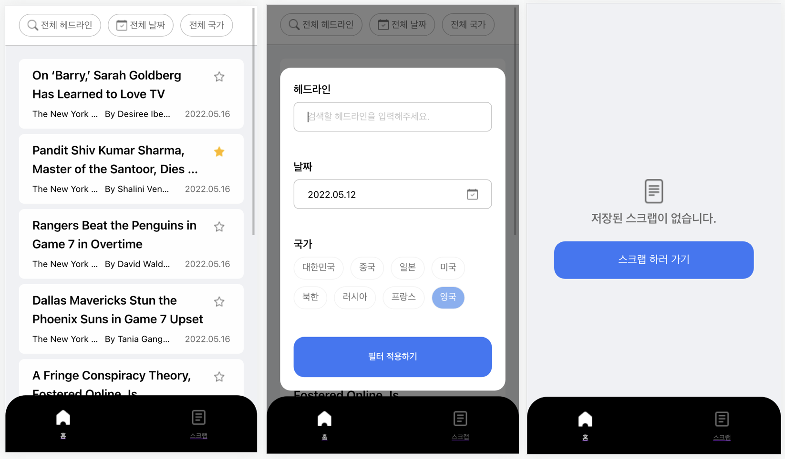

# News Mobile



## 실행 방법

1. `yarn install` node_modules 설치
2. `yarn start` 앱 실행

## 앱 설명

- `HomePage` 무한 스크롤 적용
- 페이지별 개별 필터 모달 구현
- datepicker는 가볍고 커스터마이징이 쉽게 느껴졌던 react-datepicker 라이브러리 사용
- 날짜 포맷은 utils 폴더에 함수를 구현하여 사용
- 스크랩 기사 데이터는 scrappedArticles key 값으로 로컬 저장소에 저장
- 스크랩 추가/제거시 토스트 메시지 표시
- 홈 페이지의 기사 필터링은 뉴욕 타임즈 Article Search API의 필터 쿼리를 사용

## 사용 라이브러리

- react: UI 컴포넌트 단위 개발
- typescript: interface를 이용한 정적 타이핑
- redux: 전역 상태 관리
- redux-thunk: 순차적 dispatch
- redux-devtools-extension: redux 동작 모니터링
- axios: http 통신
- styled-components: css 스타일
- react-router: 페이지 이동
- react-datepicker: 날짜 선택 컴포넌트 사용

## UI 컴포넌트 구성

- ArticleList: 기사 목록
- ArticleListItem: 기사
- BottomBar: 하단 네이게이션 바
- FilterButton: 필터 버튼
- HomeFilterBar: 홈 필터 바
- HomeFilterModal: 홈 페이지 기사 필터 모달
- LoadingSpinner: 로딩 스피너 컴포넌트
- NoScrapData: 스크랩된 데이터가 없을 경우
- ScrapFilterBar: 스크랩 필터 바
- ScrapFilterModal: 스크랩 페이지 기사 필터 모달
- ToastMessage: 토스트 메시지 컴포넌트

## 상태 값 구성

```javascript
type Page = "home" | "scrap";

interface Filter {
  headline: string;
  date: string;
  country: string[];
}

interface Article {
  _id: string;
  headline: { main: string };
  source: string;
  byline: { original: string };
  author: string;
  pub_date: string;
  isScrapped: boolean;
  web_url: string;
  keywords: { name: string, value: string }[];
}

interface NewsState {
  currentPage: Page;
  homeArticles: Article[];
  homeFilter: Filter;
  scrapFilter: Filter;
  homeModalOpen: boolean;
  scrapModalOpen: boolean;
  scrapPageStateLoaded: boolean;
  isToastMessageOn: boolean;
  toastMessage: string;
}
```
